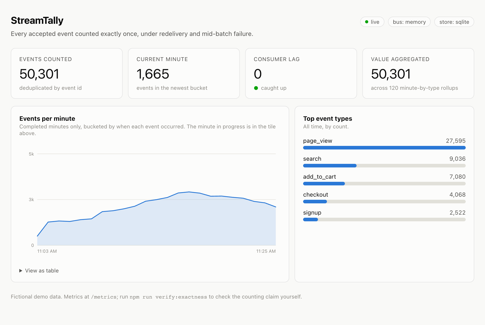
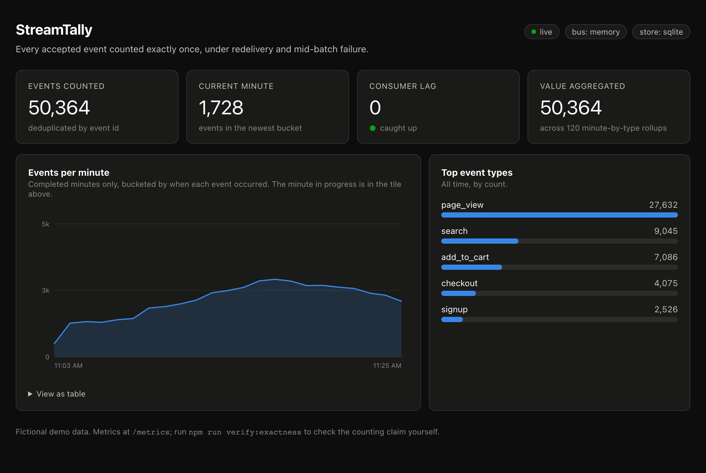
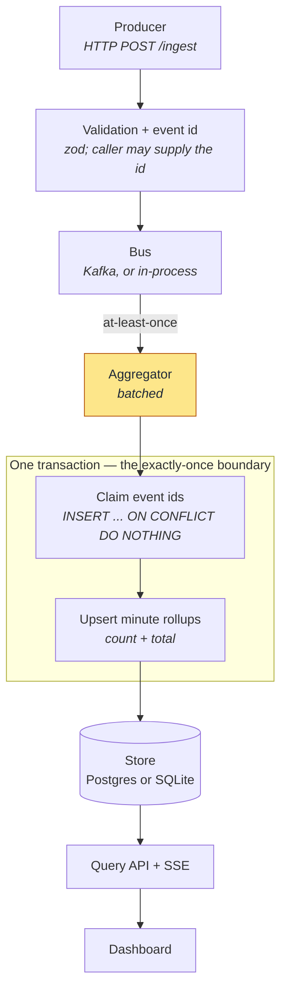

# StreamTally

[](https://github.com/jliu4950/streamtally/actions)
[](https://nodejs.org)
[](LICENSE)

**A real-time event analytics dashboard whose numbers survive being attacked.**

Anyone can render a line chart from a counter. The hard part of a streaming pipeline is that
the counter stays right when the broker redelivers a batch, when the consumer dies halfway
through, and when the producer retries an HTTP request it never saw the response to. This
project makes one narrow, falsifiable claim and ships the harness that tries to break it:

> **Every accepted event is counted exactly once — under redelivery, duplicate submission,
> and mid-batch failure.**

This is an independent portfolio project on fictional data. It does not use or reference any
employer's code, data, or production metrics.



<details>
<summary>Dark mode</summary>

Dark is a selected set of palette steps for the dark surface, not an inverted light mode.



</details>

## Quick start

No Docker, no broker, no database server:

```bash
npm install && npm run demo
```

Then in a second terminal, send it some traffic:

```bash
npm run traffic -- --backfill 22 --rps 35
```

Open <http://127.0.0.1:8080>. The generator deliberately replays about one batch in six with
the same event id — the duplicate counter climbs, the counted total does not.

To run the same code against a real Kafka-protocol broker and Postgres:

```bash
docker compose up -d --wait
BUS=kafka STORE=postgres npm start
```

## The claim, and how it is checked

```bash
npm run verify:exactness                          # in-process bus + SQLite
BUS=kafka STORE=postgres npm run verify:exactness # Redpanda + Postgres
```

Five scenarios, 5,000 unique events each. Ground truth is the set of unique event ids; the
harness compares it against what the store actually counted.

| Scenario | What it does |
|---|---|
| `clean` | no faults, no repeats — the control |
| `redelivered` | every event published twice, a tenth of them three times |
| `duplicates-within-batch` | repeats adjacent in the stream, so they land in one batch |
| `fail-before-commit` | the store throws before writing; nothing may be lost |
| `fail-after-commit` | the store **writes**, then the process dies before the offset commit |

Verified in CI on every push, against both the in-process stack **and** a real Redpanda
broker with a real Postgres: **5/5 exact** in both, drift `+0`.

`fail-after-commit` is the one that matters. The batch is durably applied and then the
acknowledgement never happens, so the bus redelivers work that is already done. An aggregator
that trusts its delivery semantics double-counts here. Only the store's idempotency claim
prevents it, which is the whole design in a single test.

### The harness has teeth

Deleting the six lines of deduplication and re-running the identical five scenarios:

| Scenario | With dedupe | Dedupe removed |
|---|---|---|
| `clean` | exact | exact |
| `redelivered` | exact | **+2,100 over-counted** |
| `duplicates-within-batch` | exact | exact (caught by the in-batch fold) |
| `fail-before-commit` | exact | exact |
| `fail-after-commit` | exact | **+1,300 over-counted** |
| | **5/5** | **3/5** |

Exactly the two scenarios that should break, break. A harness that passes no matter what the
code does is decoration, so this was checked rather than assumed.

## Architecture



Three ideas carry the whole thing:

1. **The bus guarantees at-least-once, and nothing more.** Offsets are committed only after
   the batch handler resolves. Reversing those two steps is the classic way to turn
   at-least-once into at-most-once and silently lose events on restart.
2. **Claiming an id and counting it commit together.** If they could not, a crash between
   them would either lose the event or let a redelivery count it twice. At-least-once
   delivery plus an idempotent store is what produces exactly-once *counting* — a broker
   cannot give you that part.
3. **Batches fold in memory before touching the database.** A 500-event batch usually spans a
   handful of `(minute, type)` pairs, so 500 upserts become a handful. Safe only because the
   rollup upsert is associative.

## Benchmarks

`npm run bench`. Apple M5 (10 cores), macOS 26.6.2, Node 25.8.2, in-process bus + SQLite,
10 s per case.

| Scenario | Conns | req/s | events/s | p50 | p95 | p99 | non-2xx | Counted exactly |
|---|---|---|---|---|---|---|---|---|
| single event per request | 50 | 10,099 | 10,099 | 4 ms | 11 ms | 11 ms | 0 | yes (101,017) |
| batch of 50 per request | 20 | 722 | 36,085 | 27 ms | 48 ms | 49 ms | 0 | yes (361,350) |

Two things about these numbers:

- **They measure the ingest path only** — validation, id assignment, publish, `202`.
  Aggregation is asynchronous by design, so folding it into request latency would measure the
  wrong thing. The endpoint returns `202 Accepted`, not `200`, for the same reason.
- **The benchmark also asserts correctness.** After each run it drains the pipeline and
  checks that every accepted event was counted exactly once, comparing against the server's
  own ingest counter rather than the load generator's tally of responses. A throughput
  number from a pipeline that drops events under load is worse than no number at all.

One laptop, one process, SQLite. Read it as an order of magnitude, not a capacity plan.

## Observability

`/metrics` exposes Prometheus text, including `streamtally_consumer_lag` (Kafka group lag, or
queue depth in memory mode), `streamtally_events_duplicate_total`, and latency histograms for
both the ingest path and the aggregator transaction. Consumer lag is also a tile on the
dashboard, and it always ships with a glyph and a word — `caught up`, `catching up`,
`falling behind` — so the state never depends on colour alone.

## What runs where

| | `npm run demo` | `docker compose up` |
|---|---|---|
| Bus | in-process queue | Redpanda (Kafka protocol) |
| Store | Node's built-in `node:sqlite` | Postgres 16 |
| Needs Docker | no | yes |
| Exactness harness | yes | yes, in CI |

The in-process bus is not a Kafka emulator, but it does reproduce the one property the
aggregator's correctness depends on: a batch whose handler throws goes back to the queue and
is delivered again. Without that it would be a test double that tests nothing.

CI runs lint, types, unit tests, a short load smoke pass, and the exactness harness against
the in-process stack on every push — then runs the same harness again against a real Redpanda
broker and a real Postgres, because proving the claim only against the test double would
prove it about the test double.

That second job earned its keep on the first run. The harness was handing its per-scenario
topic and consumer-group overrides to the store, which does not read them, while the bus got
the base config — so all five scenarios shared one topic and counted each other's events. It
reported 1/5 with drifts of +3000, +1137, +162 and +617. The in-process bus could never
surface it: it is a fresh object per scenario, so a topic name means nothing to it. Only a
log that outlives the process could.

## Limitations

- **A poison message stalls the pipeline permanently.** There is no dead-letter queue. A
  batch that always throws is redelivered forever, and everything behind it waits. Measured:
  publish one event with an unparseable `occurredAt` followed by 50 valid ones, and after
  three seconds the queue is 51 deep and nothing has been counted. HTTP ingest validates
  timestamps so this cannot enter that way, but anything published straight to the topic can.
  The fix is a retry ceiling per batch and a dead-letter topic; deliberately not faked here.
- **Summed values are `DOUBLE PRECISION`.** Floating-point accumulation drifts over millions
  of events, which is why the exactness harness compares totals with a `1e-6` tolerance while
  comparing counts exactly. Anything money-shaped wants integer minor units or `NUMERIC`.
- **Each SSE client polls the database independently.** One `setInterval` per connection, so
  the query load grows linearly with open dashboards. One ticker broadcasting to all
  subscribers is the obvious fix.
- **Aggregation is minute-granular and append-only.** No late-arriving-data policy, no
  watermarks, no windowing beyond a fixed bucket. An event that shows up an hour late lands
  in its true minute and silently changes a bucket the dashboard has already drawn.
- **The dedupe table grows without bound.** Real systems age it out on a retention window
  matched to the broker's, and accept the tiny risk beyond it. Not implemented here.
- **A single consumer.** Kafka partitioning is set up (three partitions, keyed by event id)
  but the aggregator is one process, so rebalance behaviour is untested.
- **`docker compose` is single-broker.** Nothing here has faced a real partition leader
  election or an ISR shrink.
- **Benchmarks are from one laptop.** Same process as the load generator, SQLite on a local
  SSD. Numbers from a shared CI runner are deliberately not published.
- **No authentication.** Every endpoint is open, including `/ingest`.

## Design decisions worth questioning

1. Why exactly-once *counting* is achievable while exactly-once *delivery* is not, and why
   the idempotency key has to come from the producer rather than the broker.
2. Why the dedupe claim and the rollup upsert must share a transaction, and what breaks if
   they are two statements with a crash between them.
3. Why the ingest endpoint returns `202` and what it would take to honestly return `200`.
4. Why folding a batch in memory before the upsert is safe — and the property of the
   aggregation that makes it safe.
5. Why the chart drops the minute currently in progress instead of plotting a partial bucket.

## Licence

MIT — see [LICENSE](LICENSE).
